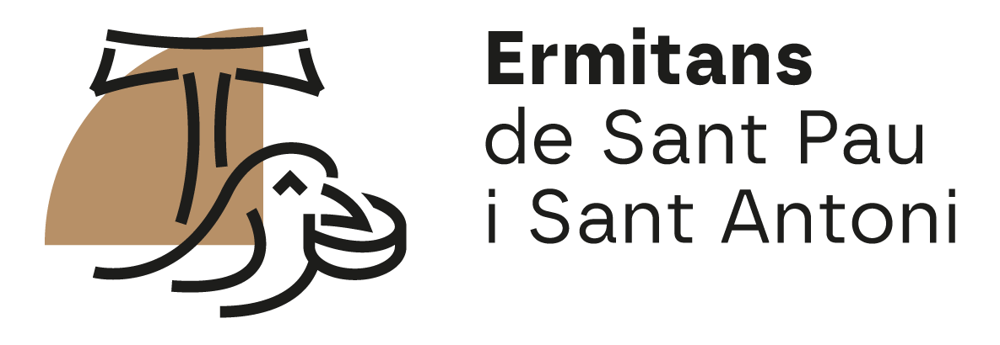

```{r setup, include=FALSE}
knitr::opts_chunk$set(echo = TRUE)
```

```{r}
csv_file <- "betlem.csv"
carpeta_fotos <- "fotos"
carpeta_thumbs <- "thumbs"
carpeta_fitxes <- "fitxes"
carpeta_zones <- "zones"
carpeta_fichas <- "fichas"
carpeta_zonas <- "zonas"
genera_portada <- TRUE
genera_portada_cast <- genera_portada
index_cast_file <- "index_cast.html"

usa_thumbs <- dir.exists(carpeta_thumbs)

if (!dir.exists(carpeta_fitxes)) dir.create(carpeta_fitxes)
if (!dir.exists(carpeta_zones)) dir.create(carpeta_zones)
if (!dir.exists(carpeta_fichas)) dir.create(carpeta_fichas)
if (!dir.exists(carpeta_zonas)) dir.create(carpeta_zonas)

slugify <- function(text) {
  text <- trimws(tolower(text))
  # llevar accents
  text <- iconv(text, from = "UTF-8", to = "ASCII//TRANSLIT")
  # espais a _
  text <- gsub(" ", "_", text)
  # llevar caràcters estranys
  text <- gsub("[^a-z0-9_]", "", text)
  text
}

format_info <- function(text) {
  parts <- strsplit(text, "//", fixed = TRUE)[[1]]
  parts <- trimws(parts)
  parts <- parts[parts != ""]
  paste0("<p>", parts, "</p>", collapse = "\n")
}

logo_html <- '
<a href="https://ermites.maioricasacra.org/betlem/ip1/" class="logo">
  
</a>
'

selector_idioma <- function(href_cat, href_esp) {
  paste0(
    '<div class="selector-idioma" style="position:absolute; top:10px; right:16px; z-index:2000; min-height:60px; display:flex; align-items:center; justify-content:flex-end; gap:22px; font-size:1.05rem; font-weight:600;">',
    '<a href="', href_cat, '" style="color:#5D3C25; text-decoration:none;">CAT</a>',
    '<a href="', href_esp, '" style="color:#5D3C25; text-decoration:none;">ESP</a>',
    '</div>\n'
  )
}
```


```{r}
dades <- read.csv2(csv_file, stringsAsFactors = FALSE, encoding = "UTF-8")

# Assegurar noms esperats
names(dades) <- trimws(names(dades))
zones_uniques <- unique(trimws(dades$Localització))
zones_unicas <- unique(trimws(dades$Localización))
```


## Català

Amb `genera_portada=TRUE` genera la portada amb la imatge `esglesia_general.jpg` i botons  per les zones que s'han de definir i colocar a mà.

```{r genera-portada, eval=genera_portada}
imatge_portada <- "esglesia_general.jpg"

# Posicions (s'han de definir a mà)
posicions <- data.frame(
 zona = c("Nau central","Presbiteri", "Cúpula", "Trans. d.",  "Trans. e."),
  top = c("65%","60%", "5%",  "70%", "70%"),
  left = c("10%", "50%", "50%", "70%",  "25%"),
  stringsAsFactors = FALSE
)

# Afegir nom de fitxer
posicions$fitxer <- paste0(slugify(zones_uniques), ".html")

# Botons
botons_html <- paste0(
  '<a href="zones/', posicions$fitxer, '">
    <div class="boto-zona" style="top: ', posicions$top, '; left: ', posicions$left, ';">
      ', posicions$zona, '
    </div>
  </a>',
  collapse = "\n"
)

# Llista de zones davall de la imatge
llista_html <- paste0(
  '<a href="zones/', posicions$fitxer, '">', zones_uniques, '</a>',
  collapse = "\n"
)

index_html <- paste0(
'<!DOCTYPE html>
<html lang="ca">
<head>
<meta charset="UTF-8">
<meta name="viewport" content="width=device-width, initial-scale=1">
<link rel="stylesheet" href="css/estil.css">
<title>Betlem</title>
</head>

<body>

', logo_html, '
', selector_idioma("index.html", index_cast_file), '
<h1>Ermita de Betlem</h1>

<div class="contenidor-imatge">
    

', botons_html, '

</div>

<div class="llista-zones">
', llista_html, '
</div>

<div class="logos-footer">
  
  
</div>

<div class="copyright">
  © 2026 Maiorica Sacra. Tots els drets reservats.
</div>
</body>
</html>'
)

writeLines(index_html, "index.html")
```


Cream les fitxes de cada imatge:


```{r}
for (i in seq_len(nrow(dades))) {
  
  foto <- trimws(dades$Foto[i])
  titol <- trimws(dades$Títol[i])
  zona <- trimws(dades$Localització[i])
  info <- trimws(dades$Informació[i])
  
  nom_html <- sub("\\.[^.]+$", ".html", foto)
  nom_zona_html <- paste0(slugify(zona), ".html")
  canvi_idioma <- selector_idioma(paste0("../fitxes/", nom_html), paste0("../fichas/", nom_html))
  info_html <- format_info(info)
  
  contingut <- paste0(
'<!DOCTYPE html>
<html lang="ca">
<head>
<meta charset="UTF-8">
<meta name="viewport" content="width=device-width, initial-scale=1">
<link rel="stylesheet" href="../css/estil.css">
<title>', titol, '</title>
</head>
<body>

<a href="https://ermites.maioricasacra.org/betlem/ip1/" class="logo">
  
</a>

', canvi_idioma, '

<h1 class="fitxa-titol">', titol, '</h1>

<div class="fitxa-text">
', info_html, '
</div>

<p><a class="tornar" href="../zones/', nom_zona_html, '">← Tornar</a></p>

<div class="logos-footer">
  
  
</div>

<div class="copyright">
  © 2026 Maiorica Sacra. Tots els drets reservats.
</div>
</body>
</html>'
  )
  
  writeLines(contingut, file.path(carpeta_fitxes, nom_html), useBytes = TRUE)
}
```

Cream les pàgines de les zones:

```{r}
zones_uniques <- unique(trimws(dades$Localització))

for (zona in zones_uniques) {
  
  subdades <- dades[trimws(dades$Localització) == zona, ]
  nom_zona <- paste0(slugify(zona), ".html")
  zona_cast_corresponent <- trimws(dades$Localización[match(zona, trimws(dades$Localització))])
  nom_zona_cast <- paste0(slugify(zona_cast_corresponent), ".html")
  canvi_idioma <- selector_idioma(paste0("../zones/", nom_zona), paste0("../zonas/", nom_zona_cast))
  zona_path <- file.path(carpeta_zones, nom_zona)
  
  carpeta_imatges_zona <- if (usa_thumbs) carpeta_thumbs else carpeta_fotos
  
  inici <- paste0(
'<!DOCTYPE html>
<html lang="ca">
<head>
<meta charset="UTF-8">
<meta name="viewport" content="width=device-width, initial-scale=1">
<link rel="stylesheet" href="../css/estil.css">
<title>', zona, '</title>
</head>
<body>

<a href="https://ermites.maioricasacra.org/betlem/ip1/" class="logo">
  
</a>

', canvi_idioma, '
<h1>', zona, '</h1>
<div class="galeria">
'
  )
  
  items <- c()
  
  for (i in seq_len(nrow(subdades))) {
    foto <- trimws(subdades$Foto[i])
    titol <- trimws(subdades$Títol[i])
    fitxa <- sub("\\.[^.]+$", ".html", foto)
    
    item_html <- paste0(
'<a href="../fitxes/', fitxa, '" class="item-link">
    <div class="item">
        
        <p class="item-titol">', titol, '</p>
        <p class="item-clica">Toca per veure la fitxa</p>
    </div>
</a>'
    )
    
    items <- c(items, item_html)
  }
  
  final <- '
</div>

<p><a class="tornar" href="../index.html">← Tornar</a></p>

<div class="logos-footer">
  
  
</div>

<div class="copyright">
  © 2026 Maiorica Sacra. Tots els drets reservats.
</div>
</body>
</html>'
  
  contingut <- paste(c(inici, items, final), collapse = "\n")
  
  writeLines(contingut, zona_path, useBytes = TRUE)
}
```

## Castellà

```{r genera-portada-cast, eval=genera_portada}
imatge_portada <- "esglesia_general.jpg"

posiciones <- data.frame(
 zona = c("Nave central","Presbiterio", "Cúpula", "Trans. d.",  "Trans. i."),
  top = c("65%","60%", "5%",  "70%", "70%"),
  left = c("10%", "50%", "50%", "70%",  "25%"),
  stringsAsFactors = FALSE
)

posiciones$fitxer <- paste0(slugify(zones_unicas), ".html")

# Botons
botones_html <- paste0(
  '<a href="zonas/', posiciones$fitxer, '">
    <div class="boto-zona" style="top: ', posiciones$top, '; left: ', posiciones$left, ';">
      ', posiciones$zona, '
    </div>
  </a>',
  collapse = "\n"
)

# Llista de zones davall de la imatge
lista_html <- paste0(
  '<a href="zonas/', posiciones$fitxer, '">', zones_unicas, '</a>',
  collapse = "\n"
)

indexcast_html <- paste0(
'<!DOCTYPE html>
<html lang="es">
<head>
<meta charset="UTF-8">
<meta name="viewport" content="width=device-width, initial-scale=1">
<link rel="stylesheet" href="css/estil.css">
<title>Betlem</title>
</head>

<body>

', logo_html, '
', selector_idioma("index.html", index_cast_file), '
<h1>Ermita de Betlem</h1>

<div class="contenidor-imatge">
    

', botones_html, '

</div>

<div class="llista-zones">
', lista_html, '
</div>

<div class="logos-footer">
  
  
</div>

<div class="copyright">
  © 2026 Maiorica Sacra. Tots els drets reservats.
</div>
</body>
</html>'
)

writeLines(indexcast_html, index_cast_file)
```


```{r}
for (i in seq_len(nrow(dades))) {
  
  foto <- trimws(dades$Foto[i])
  titulo <- trimws(dades$Título[i])
  zona_cast <- trimws(dades$Localización[i])
  info_cast <- trimws(dades$Información[i])
  
  nombre_html <- sub("\\.[^.]+$", ".html", foto)
  nombre_zona_html <- paste0(slugify(zona_cast), ".html")
  cambio_idioma <- selector_idioma(paste0("../fitxes/", nombre_html), paste0("../fichas/", nombre_html))
  info_cast_html <- format_info(info_cast)
  
  contenido <- paste0(
'<!DOCTYPE html>
<html lang="es">
<head>
<meta charset="UTF-8">
<meta name="viewport" content="width=device-width, initial-scale=1">
<link rel="stylesheet" href="../css/estil.css">
<title>', titulo, '</title>
</head>
<body>

<a href="https://ermites.maioricasacra.org/betlem/ip1/" class="logo">
  
</a>

', cambio_idioma, '

<h1 class="fitxa-titol">', titulo, '</h1>

<div class="fitxa-text">
', info_cast_html, '
</div>

<p><a class="tornar" href="../zonas/', nombre_zona_html, '">← Volver</a></p>

<div class="logos-footer">
  
  
</div>

<div class="copyright">
  © 2026 Maiorica Sacra. Tots els drets reservats.
</div>
</body>
</html>'
  )
  
  writeLines(contenido, file.path(carpeta_fichas, nombre_html), useBytes = TRUE)
}
```


```{r}
for (zona in zones_unicas) {
  
  subdades <- dades[trimws(dades$Localización) == zona, ]
  nom_zona_cast <- paste0(slugify(zona), ".html")
  zona_cat_corresponent <- trimws(dades$Localització[match(zona, trimws(dades$Localización))])
  nom_zona_cat <- paste0(slugify(zona_cat_corresponent), ".html")
  cambio_idioma <- selector_idioma(paste0("../zones/", nom_zona_cat), paste0("../zonas/", nom_zona_cast))
  zona_cast_path <- file.path(carpeta_zonas, nom_zona_cast)
  
  carpeta_imagenes_zona <- if (usa_thumbs) carpeta_thumbs else carpeta_fotos
  
  inici <- paste0(
'<!DOCTYPE html>
<html lang="es">
<head>
<meta charset="UTF-8">
<meta name="viewport" content="width=device-width, initial-scale=1">
<link rel="stylesheet" href="../css/estil.css">
<title>', zona, '</title>
</head>
<body>

<a href="https://ermites.maioricasacra.org/betlem/ip1/" class="logo">
  
</a>

', cambio_idioma, '
<h1>', zona, '</h1>
<div class="galeria">
'
  )
  
  items <- c()
  
  for (i in seq_len(nrow(subdades))) {
    foto <- trimws(subdades$Foto[i])
    titulo <- trimws(subdades$Título[i])
    ficha <- sub("\\.[^.]+$", ".html", foto)
    
    item_html <- paste0(
'<a href="../fichas/', ficha, '" class="item-link">
    <div class="item">
        
        <p class="item-titol">', titulo, '</p>
        <p class="item-clica">Toca para ver la ficha</p>
    </div>
</a>'
    )
    
    items <- c(items, item_html)
  }
  
  final <- '
</div>

<p><a class="tornar" href="../index_cast.html">← Volver</a></p>

<div class="logos-footer">
  
  
</div>

<div class="copyright">
  © 2026 Maiorica Sacra. Tots els drets reservats.
</div>
</body>
</html>'
  
  contingut <- paste(c(inici, items, final), collapse = "\n")
  
  writeLines(contingut, zona_cast_path, useBytes = TRUE)
}
```
